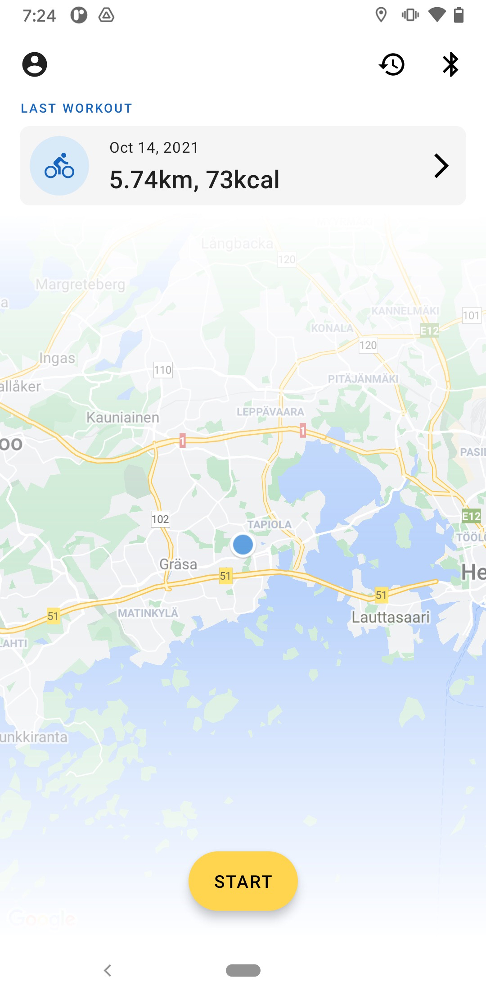
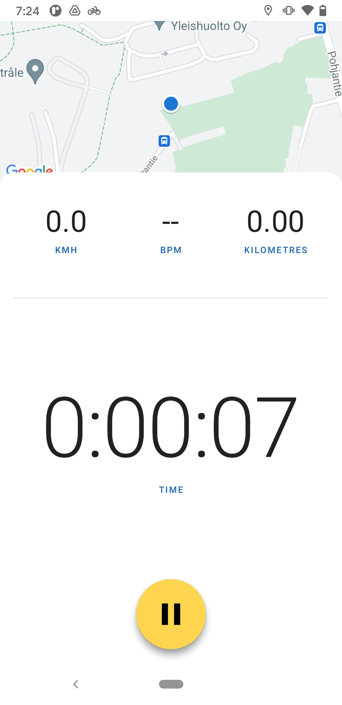
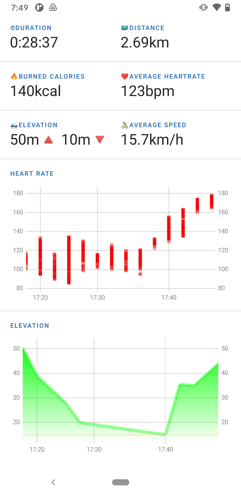
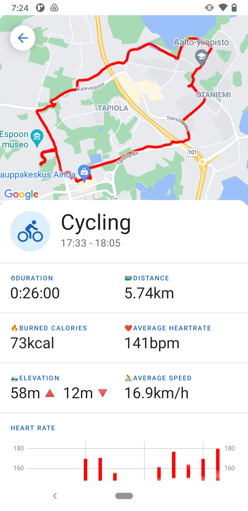
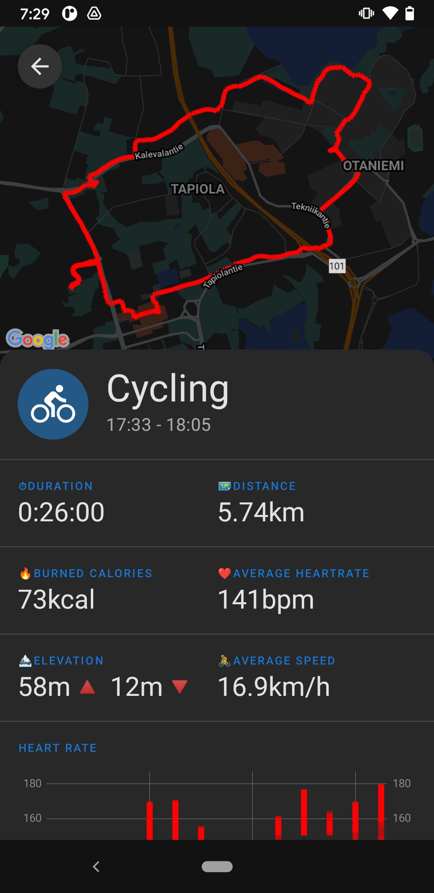
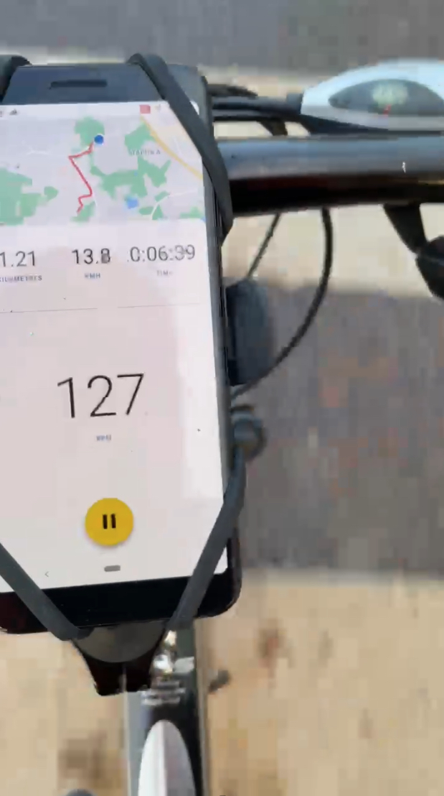

# Bike Workout

## Project Overview

This project is the outcome of a school course where we learn to develop android applications. At the end of the course we are given 4-weeks time to develop an Android app that will reflect our learning from the course.

This app keep track of your cycling workouts and provide useful information on previous workouts such as statistics about heart rate at certain location, etc. During the workout user has realtime information about workout like speed, distance, duration and heart rate.


## Technologies

1. [Kotlin](https://kotlinlang.org)
1. [Android JetPack Navigation](https://developer.android.com/guide/navigation)
1. [Android JetPack Compose](https://developer.android.com/jetpack/compose)
1. [Android Service](https://developer.android.com/guide/components/services)
1. [Android Broadcast Receiver](https://developer.android.com/guide/components/broadcasts)
1. [Android Fuse Location Provider API](https://developers.google.com/location-context/fused-location-provider/)
1. [Room](https://developer.android.com/jetpack/androidx/releases/room)


## Feature List

* [X] Real time location tracking 
* [X] Support for Bluetooth LE heart rate sensors
* [X] Workout history
* [X] Workout details and stats
* [X] Calculates burned calories
* [X] Real-time in-workout stats, like speed, heart rate and distance
* [X] Dark mode support
* [ ] Speed heat map on the map
* [ ] Notifications actions
* [ ] Auto pause
* [ ] Notify user if forgot to stop workout


### Codebase

1. This application has been written in Android Studio using Kotlin.
1. Clean codebase for easy modification and usage.


## Prerequisite

There are a couple of things you need to install to set up the development environment.

1. [Android Studio](https://developer.android.com/studio/install)

After installing Android Studio successfully in your system, you can proceed.

## How to Build and Run?

1. Clone the repo:

    ```
    git clone https://github.com/serushakov/bike-workouts.git
    ```

1. Open the project in Android studio. It will take a little while to build the project for the first time.
1. Follow [this](https://developers.google.com/maps/documentation/android-sdk/get-api-key) documentation to generate and add your API key for the maps.
1. Head over to [this](https://developer.android.com/studio/run) link for further instructions on how to run project.

#### NOTE: Google Play is needed in order to run this app so install it on your device (either device real or emulator)

## Database schema


## Screenshots

 
 
 

## Copyrights and Licensing Information
[GNU General Public License v3.0](/LICENSE)

## Known Bugs
* Calorie calculation is a bit off
* Graphs don’t handle short workouts well
* Does not reconnect automatically if heart rate sensor disconnects for more than 10 seconds


